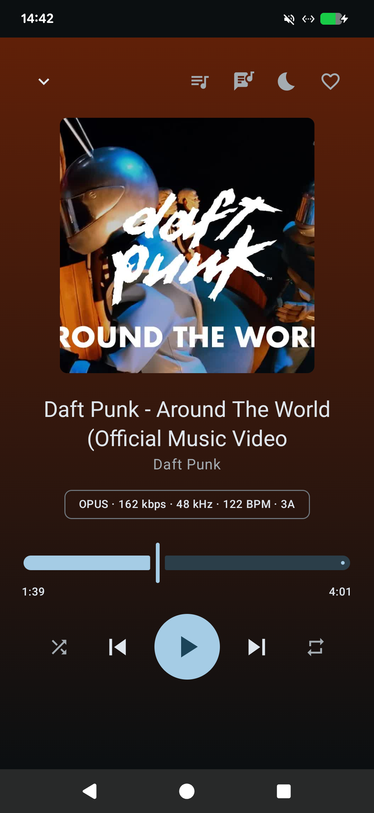
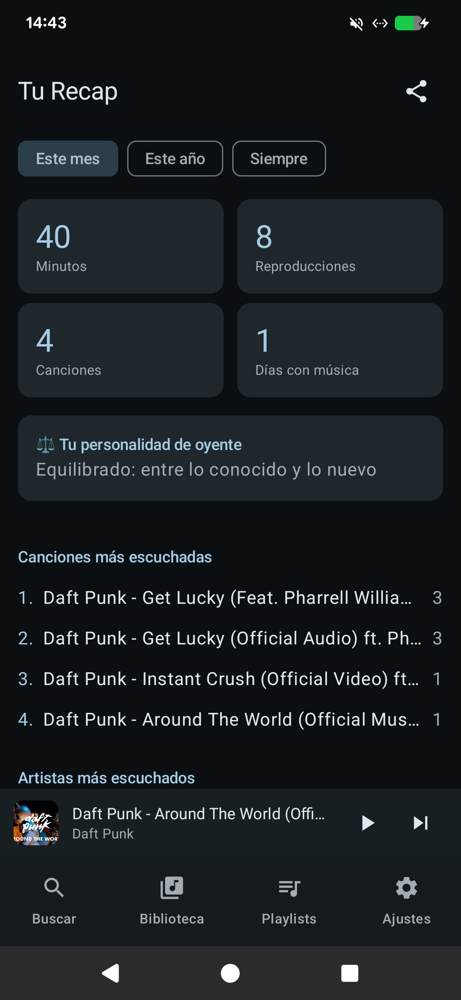

# PrivateMusic

Reproductor y descargador de música **offline** para Android. Descarga el audio de YouTube a la máxima calidad disponible, lo organiza en una biblioteca con inteligencia local y lo reproduce sin conexión, sin anuncios y sin suscripciones. Tu música es tuya para siempre.

| Reproductor | Biblioteca | Tu Recap |
|:---:|:---:|:---:|
|  |  |  |

## Instalación

Descarga el APK de la [última release](https://github.com/aarweb/PrivateMusic/releases/latest) e instálalo (Android pedirá permitir la instalación). Después, la app **se actualiza sola** desde *Ajustes → Buscar actualizaciones*.

Requiere Android 8.0+ (arm64).

## Funcionalidades

**Descarga a máxima calidad real**
- Stream `bestaudio` original de YouTube (Opus/AAC) **sin recodificar** — nada de "MP3 320 kbps" falsos.
- **Preescucha en streaming**: escucha cualquier resultado antes de decidir si lo descargas.
- yt-dlp embebido y auto-actualizable (sobrevive a los cambios de YouTube).
- SponsorBlock: recorta intros/outros y partes sin música al descargar.
- Badge con la calidad real del archivo: códec, bitrate, sample rate.

**Importación y sincronización**
- Pega una URL de **playlist de YouTube** → descárgala entera u **obsérvala** (lo nuevo se baja solo cada 6 h).
- Pega un enlace de **Spotify** (playlist/álbum/canción) → lee los metadatos públicos y empareja cada pista en YouTube filtrando por duración. También sincronizable.
- Importa CSV de Spotify (Exportify) buscando y descargando cada canción.
- Comparte cualquier enlace desde otra app hacia PrivateMusic.

**Biblioteca y playlists**
- Favoritos, historial, búsqueda en vivo, ordenación, snooze de canciones.
- Playlists normales (drag & drop, portadas personalizadas, pins), **carpetas** para organizarlas, **smart playlists** por reglas y automáticas (Más escuchadas, Olvidadas, Top de tu temporada, **Mix de hoy**).
- Carátulas de canción personalizables y editor de metadatos.
- Backup de base de datos + export/import M3U/CSV. Sin lock-in.

**Reproducción**
- Media3/ExoPlayer en segundo plano, Android Auto, widget de pantalla de inicio.
- Cola editable (reproducir a continuación, reordenar, rebarajar).
- **Letras sincronizadas offline** (LRCLIB, cacheadas al descargar) con salto por línea.
- Crossfade equal-power, **AutoMix** (iguala el BPM de la canción saliente con la entrante mediante time-stretch, sin cambiar el tono), normalización de volumen (RMS medido por canción), ecualizador con presets, sleep timer con fade-out.
- Pantalla del reproductor con color dinámico de la carátula.

**Inteligencia on-device (sin nube)**
- Análisis de cada canción al descargarla: **BPM**, **tonalidad Camelot** y huella sónica.
- **Karaoke**: separa la voz de cualquier canción con IA local (Open-Unmix en ONNX; el modelo de 36 MB se descarga una sola vez) y reproduce la instrumental con la letra sincronizada para cantar encima.
- **Radio de esta canción**: cola infinita por similitud sónica de tu propia biblioteca.
- **Aventura sónica**: una cola que transforma gradualmente una canción en otra, interpolando en el espacio de huellas sónicas.
- **Ordenar para mezclar**: reordena playlists por BPM y rueda de Camelot (transiciones DJ).

**Ritual**
- **Tu Recap** estilo Wrapped (mes/año/siempre): minutos, tops, personalidad de oyente, días memorables, logros y **tarjeta PNG compartible**.
- Scrobbling opcional a ListenBrainz.

## Compilar

Requiere JDK 17+ y Android SDK 35 (`local.properties` con `sdk.dir`).

```bash
./gradlew assembleDebug
# APK en app/build/outputs/apk/debug/app-debug.apk
```

Las releases se publican automáticamente con GitHub Actions al subir un tag `v*`.

## Stack

Kotlin · Jetpack Compose (Material 3) · Media3/ExoPlayer (`MediaLibraryService`) · Room · [youtubedl-android](https://github.com/yausername/youtubedl-android) (yt-dlp + ffmpeg) · Coil · WorkManager · DSP propio para análisis de audio (FFT, cromagrama, autocorrelación).

## Nota legal

Descargar contenido de YouTube puede infringir sus condiciones de servicio. Esta app está pensada para **uso personal y privado**, bajo tu responsabilidad. El audio de Spotify nunca se descarga (tiene DRM): solo se leen metadatos públicos de playlists.
